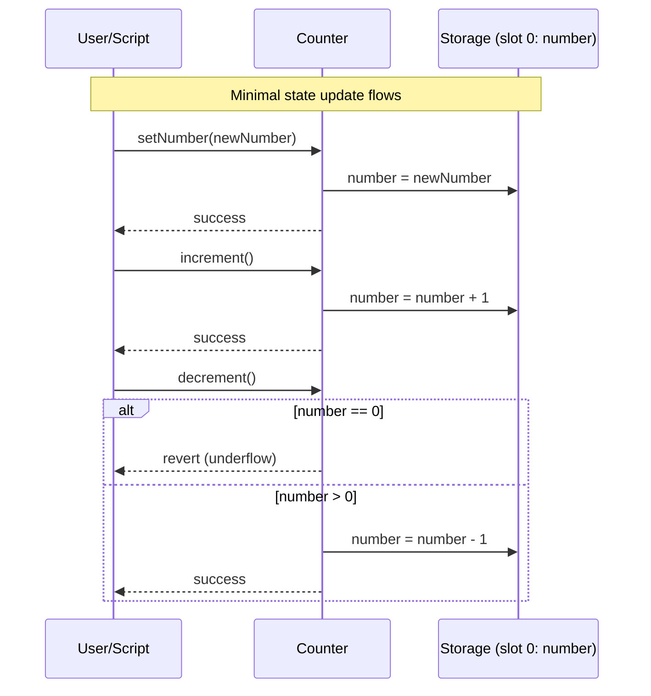

# Counter Smart Contract

A minimal EVM counter contract built with Foundry. It stores a single `uint256` value and exposes basic write operations to set, increment, and decrement the counter.

## Table of Contents

- [Counter Smart Contract](#counter-smart-contract)
  - [Table of Contents](#table-of-contents)
  - [Contract Address](#contract-address)
  - [Overview](#overview)
  - [User Stories](#user-stories)
  - [Architectural Diagram](#architectural-diagram)
  - [Architecture](#architecture)
  - [Functions](#functions)
    - [Set Number](#set-number)
    - [Increment](#increment)
    - [Decrement](#decrement)
  - [Security Features](#security-features)
  - [Testing](#testing)
    - [Running Tests](#running-tests)
  - [Technical Details](#technical-details)
    - [Storage Layout](#storage-layout)
    - [Underflow Behavior](#underflow-behavior)
  - [Development Setup](#development-setup)
  - [Usage](#usage)
    - [Deploy](#deploy)
    - [Set Number](#set-number-1)
    - [Increment](#increment-1)
    - [Decrement](#decrement-1)
  - [Technical Design](#technical-design)
    - [Key Components](#key-components)
  - [License](#license)
  - [Contributing](#contributing)

## Contract Address

- Local (Anvil): deploy on demand
- Testnet/Mainnet: _not configured in this repo_

## Overview

The `Counter` contract provides a simple way to:
- Store a single `uint256` value (`number`)
- Update it via `setNumber(uint256)`
- Increment it via `increment()`
- Decrement it via `decrement()` (reverts on underflow)

This project is intended as a learning and testing scaffold using Foundry.

## User Stories

- **As a developer**, I want a minimal stateful contract so I can learn Foundry testing and deployment basics.
- **As a tester**, I want deterministic state transitions so I can write simple unit tests and fuzz tests.
- **As an integrator**, I want a public getter for the state so my frontend/scripts can read `number` easily.

## Architectural Diagram



## Architecture

Single contract, single storage slot:

- **State**: `uint256 public number`
- **Write methods**:
  - `setNumber(newNumber)`
  - `increment()`
  - `decrement()`

## Functions

### Set Number

Sets the counter to an arbitrary value.

**Function:** `setNumber(uint256 newNumber)`

**Parameters:**
- `newNumber`: new value for `number`

### Increment

Increments the stored number by 1.

**Function:** `increment()`

**Parameters:** None

### Decrement

Decrements the stored number by 1.

**Function:** `decrement()`

**Parameters:** None

## Security Features

- **Built-in underflow protection**: Solidity \(>=0.8\) reverts on underflow/overflow automatically.
- **Simple surface area**: no external calls, no token transfers, no Ether handling.

## Testing

Tests are written with Foundry in `test/Counter.t.sol` and cover:

1. **Increment**: increases `number` from 0 → 1
2. **Decrement reverts**: `decrement()` reverts when `number == 0`
3. **Fuzz setNumber**: validates arbitrary `uint256` inputs

### Running Tests

```bash
forge test
```

## Technical Details

### Storage Layout

- Slot 0: `number` (`uint256`)

### Underflow Behavior

`decrement()` will revert when `number == 0` due to Solidity’s checked arithmetic. The test suite asserts this revert.

## Development Setup

```bash
forge install
forge build
```

## Usage

### Deploy

Start a local chain:

```bash
anvil
```

In another terminal, deploy:

```bash
forge create --rpc-url http://127.0.0.1:8545 --private-key <ANVIL_PRIVATE_KEY> src/Counter.sol:Counter
```

### Set Number

```bash
cast send <COUNTER_ADDRESS> "setNumber(uint256)" 42 --rpc-url <RPC_URL> --private-key <PRIVATE_KEY>
```

### Increment

```bash
cast send <COUNTER_ADDRESS> "increment()" --rpc-url <RPC_URL> --private-key <PRIVATE_KEY>
```

### Decrement

```bash
cast send <COUNTER_ADDRESS> "decrement()" --rpc-url <RPC_URL> --private-key <PRIVATE_KEY>
```

## Technical Design

### Key Components

1. **State Variable**
   - `number`: the single persisted counter value

2. **Public Getter**
   - `number()` auto-generated getter from `public`

3. **Arithmetic Safety**
   - relies on Solidity \(>=0.8\) checked arithmetic

## License

This project is provided as-is for educational use. If you want an explicit license, add a `LICENSE` file at the repo root and reference it here.

## Contributing

Contributions are welcome:
- Keep the contract minimal and the tests comprehensive
- Run `forge fmt` and `forge test` before opening a PR
