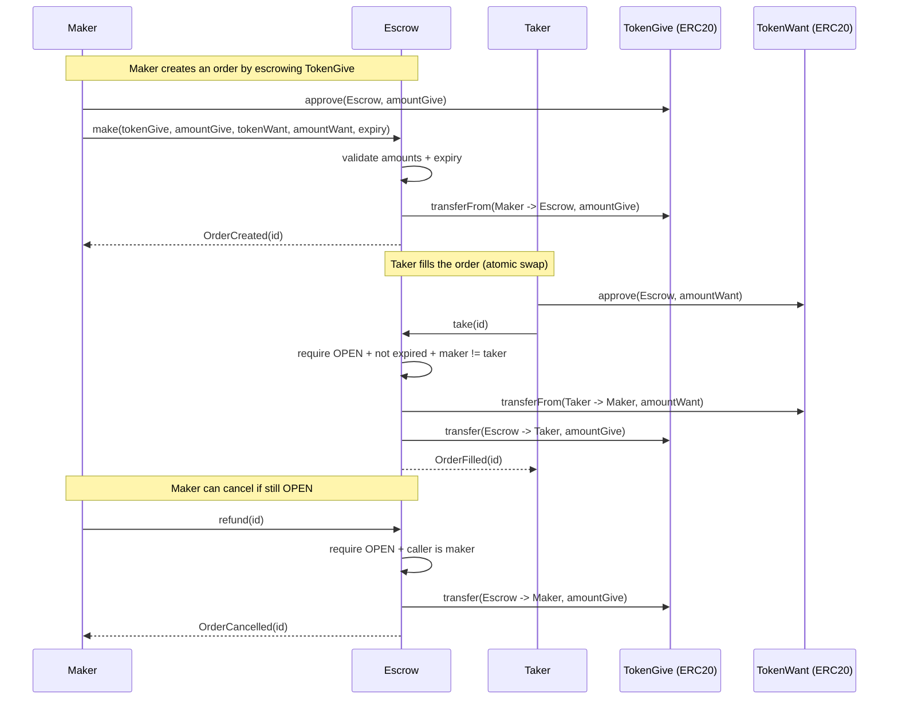

# Token Swap Escrow Smart Contract

A minimal ERC20-for-ERC20 escrow that enables atomic swaps using maker orders. Makers create orders by depositing the “give” token into the contract; takers fill orders by paying the “want” token directly to the maker, and receiving the escrowed “give” tokens in return.

## Table of Contents

- [Token Swap Escrow Smart Contract](#token-swap-escrow-smart-contract)
  - [Table of Contents](#table-of-contents)
  - [Contract Address](#contract-address)
  - [Overview](#overview)
  - [User Stories](#user-stories)
  - [Architectural Diagram](#architectural-diagram)
  - [Architecture](#architecture)
  - [Functions](#functions)
    - [Make (Create Order)](#make-create-order)
    - [Take (Fill Order)](#take-fill-order)
    - [Refund (Cancel Order)](#refund-cancel-order)
  - [Security Features](#security-features)
  - [Testing](#testing)
    - [Running Tests](#running-tests)
  - [Technical Details](#technical-details)
    - [Order Lifecycle](#order-lifecycle)
    - [SafeERC20 Transfers](#safeerc20-transfers)
    - [Expiration](#expiration)
  - [Development Setup](#development-setup)
  - [Usage](#usage)
    - [Deploy](#deploy)
    - [Create an Order](#create-an-order)
    - [Fill an Order](#fill-an-order)
    - [Cancel an Order](#cancel-an-order)
    - [Read Order State](#read-order-state)
  - [Technical Design](#technical-design)
    - [Account Structure](#account-structure)
    - [Key Components](#key-components)
  - [License](#license)
  - [Contributing](#contributing)

## Contract Address

- Local (Anvil): deploy on demand
- Testnet/Mainnet: _not configured in this repo_

## Overview

The `Escrow` contract provides a simple order-based token swap primitive:

- A **maker** creates an order by escrowing `tokenGive` in the contract
- A **taker** fills the order by transferring `tokenWant` to the maker
- The contract atomically releases `tokenGive` to the taker
- Makers can **cancel** an open order to recover their escrowed tokens

Orders include an `expiration` timestamp to prevent stale fills.

## User Stories

- **As a maker**, I want to escrow my “give” tokens so I can offer a trust-minimized swap.
- **As a taker**, I want to atomically trade my tokens for the maker’s escrowed tokens without custody risk.
- **As a maker**, I want to cancel an unfilled order so I can recover my escrowed tokens.
- **As a user**, I want expirations so stale orders can’t be filled unexpectedly.

## Architectural Diagram



## Architecture

Core storage:

1. **Orders**
   - `orders[id] -> Order`
   - `Order` fields: maker, tokenGive, amountGive, tokenWant, amountWant, expiration, status

2. **Order ids**
   - `nextOrderId` monotonically increments

Order flow:

- **make**: transfers `amountGive` of `tokenGive` from maker to contract and records an OPEN order
- **take**: transfers `amountWant` of `tokenWant` from taker to maker, then releases escrowed `tokenGive` to taker and marks FILLED
- **refund**: returns escrowed `tokenGive` to maker and marks CANCELLED

## Functions

### Make (Create Order)

Creates a new escrow order and transfers `tokenGive` into the contract.

**Function:** `make(address tokenGive, uint256 amountGive, address tokenWant, uint256 amountWant, uint256 expiration) returns (uint256 id)`

**Requirements:**
- `amountGive > 0 && amountWant > 0`
- `block.timestamp < expiration`
- maker must have approved the escrow contract for `amountGive` of `tokenGive`

### Take (Fill Order)

Fills an open order if not expired.

**Function:** `take(uint256 id)`

**Requirements:**
- `orders[id].status == OPEN`
- `block.timestamp < orders[id].expiration`
- `orders[id].maker != msg.sender`
- taker must have approved the escrow contract for `amountWant` of `tokenWant`

### Refund (Cancel Order)

Cancels an open order and returns escrowed `tokenGive` to the maker.

**Function:** `refund(uint256 id)`

**Requirements:**
- `orders[id].status == OPEN`
- `orders[id].maker == msg.sender`

## Security Features

- **Safe ERC20 handling**: uses OpenZeppelin `SafeERC20`.
- **Order state machine**: explicit `Status` guards prevent re-fills and double refunds.
- **Expiration checks**: orders cannot be created already-expired and cannot be filled after expiry.
- **Maker cannot self-fill**: prevents accidental self-trades and simplifies accounting.
- **Checks-effects-interactions**: `status` is set to `FILLED/CANCELLED` before external transfers.

## Testing

Tests in `test/Counter.t.sol` (escrow test suite) cover:

1. **Make + Take**: maker escrows tokenA, taker pays tokenB, swap completes
2. **Refund**: maker cancels and gets tokenGive back
3. **Expired order fill reverts**: `ORDER_EXPIRED`
4. **Not-open order fill reverts**: `NOT_OPEN`

### Running Tests

```bash
forge test
```

## Technical Details

### Order Lifecycle

- `OPEN` → `FILLED` via `take(id)`
- `OPEN` → `CANCELLED` via `refund(id)`

The contract does not implement partial fills; orders are all-or-nothing.

### SafeERC20 Transfers

Token movements:

- On `make`:
  - `tokenGive.safeTransferFrom(maker, escrow, amountGive)`
- On `take`:
  - `tokenWant.safeTransferFrom(taker, maker, amountWant)`
  - `tokenGive.safeTransfer(taker, amountGive)`
- On `refund`:
  - `tokenGive.safeTransfer(maker, amountGive)`

### Expiration

The contract uses `block.timestamp` for expiry checks:
- `make` requires `now < expiration`
- `take` requires `now < expiration`

## Development Setup

```bash
forge install
forge build
```

## Usage

### Deploy

Start a local chain:

```bash
anvil
```

Deploy the escrow:

```bash
forge create --rpc-url http://127.0.0.1:8545 --private-key <ANVIL_PRIVATE_KEY> src/Escrow.sol:Escrow
```

### Create an Order

Approve `tokenGive` to the escrow, then create the order:

```bash
cast send <TOKEN_GIVE> "approve(address,uint256)" <ESCROW_ADDRESS> <AMOUNT_GIVE> --rpc-url <RPC_URL> --private-key <MAKER_KEY>
cast send <ESCROW_ADDRESS> "make(address,uint256,address,uint256,uint256)" <TOKEN_GIVE> <AMOUNT_GIVE> <TOKEN_WANT> <AMOUNT_WANT> <EXPIRATION_UNIX> --rpc-url <RPC_URL> --private-key <MAKER_KEY>
```

### Fill an Order

Approve `tokenWant` to the escrow, then fill:

```bash
cast send <TOKEN_WANT> "approve(address,uint256)" <ESCROW_ADDRESS> <AMOUNT_WANT> --rpc-url <RPC_URL> --private-key <TAKER_KEY>
cast send <ESCROW_ADDRESS> "take(uint256)" <ORDER_ID> --rpc-url <RPC_URL> --private-key <TAKER_KEY>
```

### Cancel an Order

```bash
cast send <ESCROW_ADDRESS> "refund(uint256)" <ORDER_ID> --rpc-url <RPC_URL> --private-key <MAKER_KEY>
```

### Read Order State

```bash
cast call <ESCROW_ADDRESS> "orders(uint256)(address,address,uint256,address,uint256,uint256,uint8)" <ORDER_ID> --rpc-url <RPC_URL>
```

## Technical Design

### Key Components

1. **Order struct**
   - Encodes swap terms and current status

2. **Status enum**
   - Guards fill/cancel paths: `OPEN`, `FILLED`, `CANCELLED`

3. **Events**
   - `OrderCreated`, `OrderFilled`, `OrderCancelled`

## License

This project is provided as-is for educational use. If you want an explicit license, add a `LICENSE` file and reference it here.

## Contributing

Contributions are welcome:
- Add negative tests (maker cannot take, refund after fill, etc.)
- Run `forge fmt` and `forge test` before opening a PR
