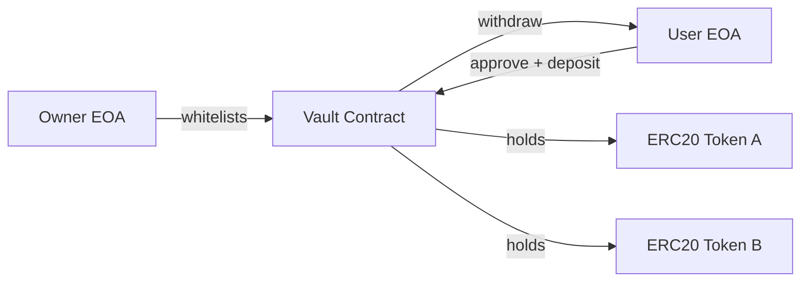

# Token Vault Smart Contract

A simple, owner-managed ERC20 vault that supports *multiple whitelisted tokens*. Users can deposit and withdraw supported ERC20s, with per-user balances tracked inside the contract.

## Table of Contents

- [Token Vault Smart Contract](#token-vault-smart-contract)
  - [Table of Contents](#table-of-contents)
  - [Contract Address](#contract-address)
  - [Overview](#overview)
  - [Architecture](#architecture)
  - [Functions](#functions)
    - [Add Token](#add-token)
    - [Remove Token](#remove-token)
    - [Deposit](#deposit)
    - [Withdraw](#withdraw)
  - [Security Features](#security-features)
  - [Testing](#testing)
    - [Running Tests](#running-tests)
  - [Technical Details](#technical-details)
    - [Balance Accounting](#balance-accounting)
    - [SafeERC20 Transfers](#safeerc20-transfers)
    - [Whitelisting Model](#whitelisting-model)
  - [Development Setup](#development-setup)
  - [Usage](#usage)
    - [Deploy](#deploy)
    - [Add/Remove Supported Tokens](#addremove-supported-tokens)
    - [Deposit Tokens](#deposit-tokens)
    - [Withdraw Tokens](#withdraw-tokens)
    - [Read Balances](#read-balances)
  - [Technical Design](#technical-design)
    - [Account Structure](#account-structure)
    - [Key Components](#key-components)
  - [License](#license)
  - [Contributing](#contributing)

## Contract Address

- Local (Anvil): deploy on demand
- Testnet/Mainnet: _not configured in this repo_

## Overview

The `Vault` contract provides:
- **Token whitelisting** controlled by an `owner`
- **Deposits** of supported ERC20 tokens into the vault contract
- **Withdrawals** of deposited ERC20 tokens back to the depositing user
- **Per-user, per-token accounting** via `balanceOf[user][token]`

This contract is intentionally minimal and designed for learning/testing with Foundry.

## Architecture

Core storage:

1. **User balances**
   - `balanceOf[user][token] -> uint256`

2. **Token allowlist**
   - `isSupportedToken[token] -> bool`

3. **Admin**
   - `owner -> address`

Token movement:
- **Deposit**: `user -> vault` via `transferFrom`
- **Withdraw**: `vault -> user` via `transfer`

## Functions

### Add Token

Whitelists an ERC20 token address so deposits are allowed.

**Function:** `addToken(address token)`

**Access:** `onlyOwner`

### Remove Token

Removes an ERC20 token from the whitelist (future deposits blocked).

**Function:** `removeToken(address token)`

**Access:** `onlyOwner`

### Deposit

Deposits a supported ERC20 into the vault and credits `balanceOf[msg.sender][token]`.

**Function:** `deposit(address token, uint256 amount)`

**Requirements:**
- `isSupportedToken[token] == true`
- `amount > 0`
- user must have approved the vault for `amount`

### Withdraw

Withdraws tokens previously deposited by the caller.

**Function:** `withdraw(address token, uint256 amount)`

**Requirements:**
- `amount > 0`
- `balanceOf[msg.sender][token] >= amount`

## Security Features

- **Safe ERC20 handling**: uses OpenZeppelin `SafeERC20` to support non-standard ERC20 return values.
- **Checks-effects-interactions**: balance is decremented before transferring on `withdraw`.
- **Whitelisting**: blocks deposits of unknown tokens (reduces surprise asset handling).
- **Explicit revert reasons**: `NOT_OWNER`, `TOKEN_NOT_SUPPORTED`, `ZERO_AMOUNT`, `INSUFFICIENT_BALANCE`.

## Testing

Tests in `test/Vault.sol` cover:

1. **Deposit multiple tokens**: user deposits USDC + EURC and balances update
2. **Withdraw multiple tokens**: user withdraws and balances + token balances update
3. **Unsupported token deposit reverts**: `TOKEN_NOT_SUPPORTED`
4. **Over-withdraw reverts**: `INSUFFICIENT_BALANCE`

### Running Tests

```bash
forge test
```

## Technical Details

### Balance Accounting

Balances are internal-only accounting:

- Deposits increase `balanceOf[user][token]`
- Withdrawals decrease `balanceOf[user][token]`
- The vault contract must hold enough token balance to honor withdrawals (it should, assuming no external token movement from the vault).

### SafeERC20 Transfers

The vault uses:
- `safeTransferFrom(user, vault, amount)` on deposit
- `safeTransfer(user, amount)` on withdraw

This improves compatibility with ERC20s that do not strictly follow the ERC20 return-value spec.

### Whitelisting Model

- Whitelisting affects **deposit eligibility** only.
- Removing a token does **not** prevent users from withdrawing previously deposited balances (withdraw has no `isSupportedToken` check).

## Development Setup

```bash
forge install
forge build
```

## Usage

### Deploy

Start a local chain:

```bash
anvil
```

Deploy the vault:

```bash
forge create --rpc-url http://127.0.0.1:8545 --private-key <ANVIL_PRIVATE_KEY> src/Vault.sol:Vault
```

### Add/Remove Supported Tokens

```bash
cast send <VAULT_ADDRESS> "addToken(address)" <TOKEN_ADDRESS> --rpc-url <RPC_URL> --private-key <PRIVATE_KEY>
cast send <VAULT_ADDRESS> "removeToken(address)" <TOKEN_ADDRESS> --rpc-url <RPC_URL> --private-key <PRIVATE_KEY>
```

### Deposit Tokens

Approve first:

```bash
cast send <TOKEN_ADDRESS> "approve(address,uint256)" <VAULT_ADDRESS> <AMOUNT> --rpc-url <RPC_URL> --private-key <PRIVATE_KEY>
```

Then deposit:

```bash
cast send <VAULT_ADDRESS> "deposit(address,uint256)" <TOKEN_ADDRESS> <AMOUNT> --rpc-url <RPC_URL> --private-key <PRIVATE_KEY>
```

### Withdraw Tokens

```bash
cast send <VAULT_ADDRESS> "withdraw(address,uint256)" <TOKEN_ADDRESS> <AMOUNT> --rpc-url <RPC_URL> --private-key <PRIVATE_KEY>
```

### Read Balances

```bash
cast call <VAULT_ADDRESS> "balanceOf(address,address)(uint256)" <USER_ADDRESS> <TOKEN_ADDRESS> --rpc-url <RPC_URL>
```

## Technical Design

### Account Structure



### Key Components

1. **Owner**
   - Controls allowlist via `addToken/removeToken`

2. **Allowlist**
   - `isSupportedToken[token]` gates deposits

3. **Balance mapping**
   - `balanceOf[user][token]` tracks user balances per token

4. **Events**
   - `Deposit`, `Withdraw`, `TokenAdded`, `TokenRemoved`

## License

This project is provided as-is for educational use. If you want an explicit license, add a `LICENSE` file and reference it here.

## Contributing

Contributions are welcome:
- Add tests for edge cases (zero approvals, fee-on-transfer tokens, etc.)
- Run `forge fmt` and `forge test` before opening a PR
